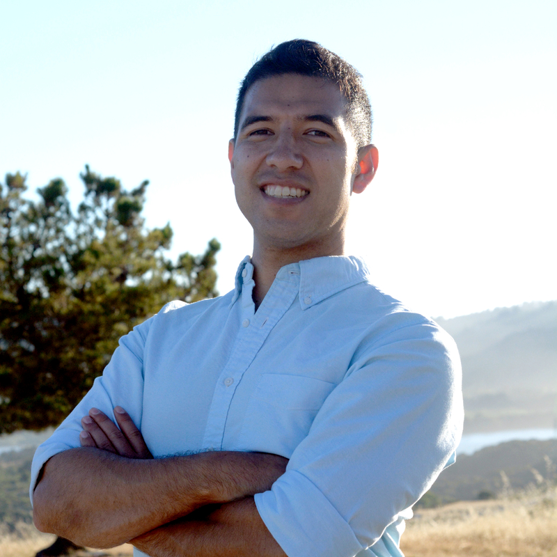

# &middot; [Aldrin Montana](profile)

<!-- Developer ID -->
[Keybase](https://keybase.io/octalene)

[GitHub](https://github.com/drin)

[GitLab](https://gitlab.com/octalene)

<!-- Professional ID -->
[Polywork](https://www.polywork.com/aldrin)

[LinkedIn](https://linkedin.com/in/drinmontana)

<!-- Research ID -->
[OrcID](https://orcid.org/0000-0003-2073-4813)

[dblp](https://dblp.org/pers/hd/m/Montana:Aldrin)
    
<!-- Contact Info -->
[Email](mailto:drinmontana@duck.com)

---

### About Me

I am currently a 5th year PhD student in computer science ([CMPS][web-phdreqs]) at UC Santa Cruz,
advised by [Peter Alvaro][person-palvaro]. My research interest is in the intersection of data
management systems, storage systems, programming languages, and bioinformatics. I primarily work
with Peter Alvaro, Carlos Maltzahn, and Jeff LeFevre; but, I also work with Josh Stuart and Philip
Kufeldt (Seagate). Additionally, I am trying to contribute to the [Apache Arrow][community-arrow]
and [Human Cell Atlas][community-hca] communities.

### [Research](research/README.md)

I am working on research to leverage computational storage drives (CSDs) for
bioinformatics (and, more generally, scientific computing workloads). To make my research
easier to build on or use, I have separated parts of it into separate projects which I
will try to make individually useful.

##### Projects

**[MSG Express](research/msg-express/overview.md).** A domain-specific data management
system for single-cell gene expression data ("gene expression"). This should be a library
usable by application developers for interacting with gene expression data and for storing
and managing that data in a computational storage system.

**Skytether.** A computational storage system that is spiritually an extension of
SkyhookDM for computational storage devices (CSx). The version I'm building can stand on
its own, but will largely be a prototype platform for research.

**Mohair.** A library for translating query plans into and from substrait as decomposable
query plans.

| Topic    | Date     | Title                                                                       |
| -------- | -------- | --------------------------------------------------------------------------- |
| SkySQL   | 22-05-XX | [MSG Express and Skytether](research/skysql/landscape.md)                   |
| SkySQL   | 22-05-XX | [SkySQL Defined](research/skysql/overview.md)                               |

<!-- Work in Progress -->
<!--| SkySQL   | 22-06-XX | [Using Arrow Compute Engine](research/skysql/using-arrow-compute-engine.md) |-->

####  Readings

[&middot; Reading Log.](readings/reading-log.md) Here is a list of my past readings and relevant
thoughts. If I go back and re-read a paper, I'll simply append to the entry for that reading so
that changes in opinion can be referenced (for my own curiosity).

[&middot; Reading Queue.](readings/reading-queue.md) Here is a list of materials I plan on reading.

<!-- ----------------------------- -->
<!-- Resources -->

<!-- >> In progress content -->
<!--
-->

<!-- >> External URLs -->
<!--    >>> misc links -->
[web-phdreqs]:     https://www.soe.ucsc.edu/departments/computer-science-and-engineering/graduate/degree-requirements-cmps#phd

[person-palvaro]:  https://people.ucsc.edu/~palvaro/

[community-arrow]: https://arrow.apache.org/community/
[community-hca]:   https://www.humancellatlas.org/

<!--    >>> exploration links -->

<!--    >>> navigational links -->
[resource-ucsc-calendar]:  https://calendar.google.com/calendar?cid=YWttb250YW5AdWNzYy5lZHU

[docs-sniadict]:   https://www.snia.org/sites/default/files/dictionary/SNIADictionary.pdf
